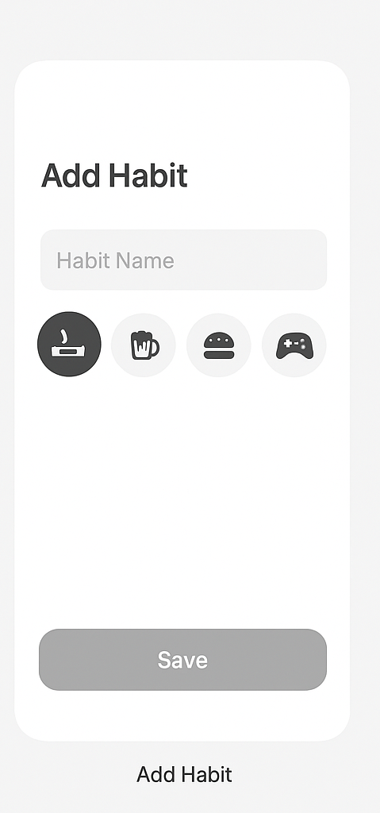
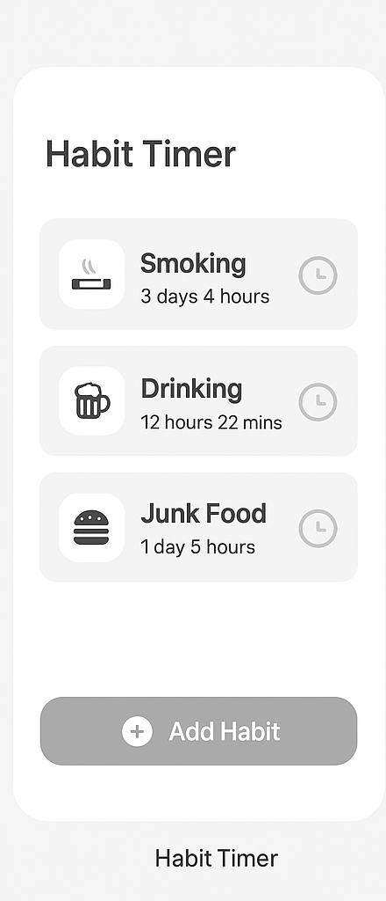

# Habit Tracker App  

  
  
  
  
  

---

A minimal, distraction-free **habit tracker app** built completely using **Jetpack Compose, SOLID Principles, MVVM, Room DB, and Dependency Injection**.  
This app helps users **track habits they want to leave**, such as smoking, drinking, junk food, or gaming, and measures how long they’ve stayed away from them.

---

## Screenshots  

### Add Habit  


### Habit Details  


### Habit Timer Dashboard  


---

## Features  

- **Add Habits** → Create new habits you want to quit (e.g., Smoking, Drinking, Junk Food, Gaming).  
- **Live Timers** → See how long it’s been since you last gave in to a habit.  
- **Streak Tracking** → Track **current streak** and **longest streak** for each habit.  
- **History Log** → Keep a record of past resets for accountability.  
- **Reset Option** → One-tap reset when you slip, so the timer starts again.  
- **Modern UI** → Clean, minimal design fully built with **Jetpack Compose (vibe coding only)**.  

---

## Tech Stack  

- **Language:** Kotlin  
- **UI Framework:** Jetpack Compose (100% vibe coding, no XML)  
- **Architecture:** MVVM  
- **State Handling:** `State`, `ViewModel`, `remember`  
- **Persistence:** Room DB / DataStore  
- **Dependency Injection:** Hilt or Koin  

---

## Getting Started  

Clone this repository:  

```bash
git clone https://github.com/your-username/habit-tracker.git
cd habit-tracker
Open the project in Android Studio (latest stable).

Make sure you have:

Android Studio Giraffe or newer

Kotlin 1.9+

Jetpack Compose 1.5+

Run the app on an emulator or physical device:
./gradlew installDebug


📜 License

This project is open source under the MIT License.

